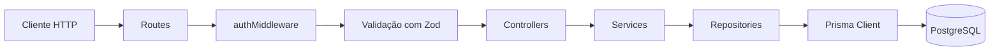

# Diagrama de arquitetura

## Organização das camadas

Os módulos da API seguem uma estrutura parecida. A requisição entra pela rota, passa pelos middlewares e segue até a camada responsável pelo acesso ao banco:



Cada camada tem uma responsabilidade específica:

* As rotas recebem as requisições e configuram os middlewares.
* Os controllers lidam com os dados da requisição e montam a resposta.
* Os services concentram as regras de negócio.
* Os repositories fazem a comunicação com o banco de dados por meio do Prisma.

Quando ocorre algum erro, como um `AppError` ou `ZodError`, ele é encaminhado até o `errorHandler` central. Como a aplicação usa o Express 5, erros lançados em funções assíncronas também são encaminhados automaticamente.

O `errorHandler` identifica o tipo do erro e devolve a resposta HTTP correspondente.

## Módulos da aplicação

Os módulos ficam dentro de `src/modules`:

```text
modules/
  auth/          registro, login, schemas, service, controller e rotas
  users/         acesso aos dados dos usuários
  lists/         criação e consulta de listas
  tasks/         criação, consulta e gerenciamento de tarefas
```

Cada módulo possui uma função no formato `createXRoutes(...repositories)`. Essa função monta o controller e o service do módulo, recebendo seus repositories por injeção de dependência.

Por padrão, são utilizados repositories com implementação em Prisma. Durante os testes, eles podem ser substituídos por versões fake, permitindo testar os services e as rotas sem depender de um banco de dados real.

O módulo `users` possui apenas o repository porque, no momento, não existe um CRUD público de usuários. Os dados desse módulo são utilizados internamente pelo `auth` durante o cadastro e o login.

O módulo `lists` possui suas próprias rotas, como:

```text
POST /lists
GET /lists
```

O módulo `tasks` também consulta as listas. Isso é necessário para verificar se a lista informada realmente pertence ao usuário autenticado antes de criar, alterar ou buscar uma tarefa.

## Controle de acesso aos dados

As tarefas não possuem um `userId` diretamente.

A relação com o usuário é feita por meio da lista:

```text
task → list_id → task_lists.user_id
```

Sempre que uma operação envolve uma tarefa ou uma lista, o `TaskService` verifica a propriedade do recurso.

O fluxo dessa validação é:

1. Busca a lista utilizando o `ITaskListRepository`.
2. Compara o `userId` da lista com o `req.user.id`.
3. Permite a operação somente quando os identificadores são iguais.

O `req.user.id` é preenchido pelo `authMiddleware` com base no campo `sub` do token JWT.

Quando a lista ou tarefa não existe, ou quando pertence a outro usuário, a API retorna um `NotFoundError` com status `404`.

As duas situações retornam a mesma resposta de propósito. Dessa forma, um usuário não consegue descobrir se determinado recurso existe na conta de outra pessoa.

## Estrutura de pastas

A pasta `src` está organizada da seguinte forma:

```text
src/
  config/       validação das variáveis de ambiente com Zod
  docs/         documentação OpenAPI exibida em /docs
  modules/      módulos de auth, users, lists e tasks
  routes/       montagem das rotas da aplicação em /api/v1
  shared/
    database/   instância compartilhada do PrismaClient
    errors/     AppError e erros específicos da aplicação
    middlewares/ autenticação, validação e tratamento de erros
    types/      tipos adicionais do Express, como req.user
    utils/      funções de JWT, hash de senha e logger
```

A separação por módulos e camadas mantém a lógica de negócio isolada do acesso ao banco e da camada HTTP. Além de facilitar a manutenção, isso também deixa os testes mais simples, já que cada parte pode ser testada separadamente.
