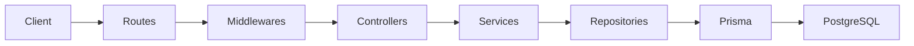

# Diagrama de arquitetura

> Preencher após a definição final das camadas e responsabilidades.

```mermaid
flowchart LR
  Client --> Routes
  Routes --> Middlewares
  Middlewares --> Controllers
  Controllers --> Services
  Services --> Repositories
  Repositories --> Prisma
  Prisma --> PostgreSQL
```
