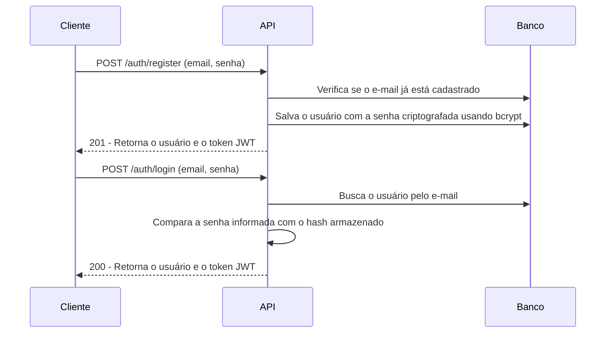
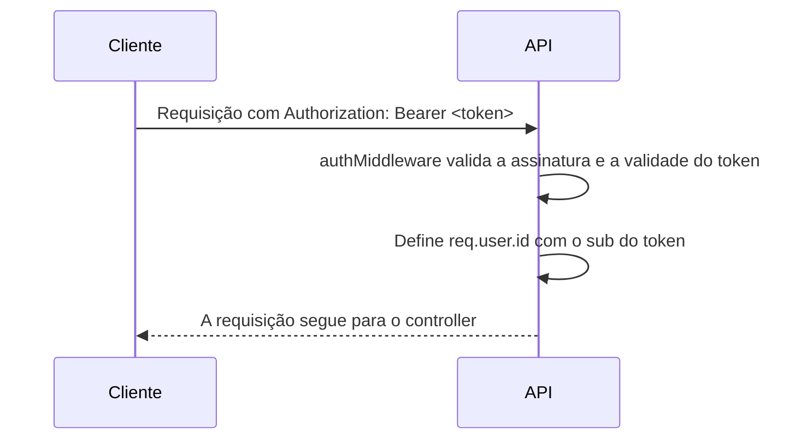

# Fluxo de autenticação

A autenticação da API funciona com JWT e não utiliza sessões armazenadas no banco de dados.

Ao realizar o login ou o cadastro, o usuário recebe um token que contém seu identificador no campo `sub`. Esse token deve ser enviado nas requisições protegidas e é validado pela API sempre que uma nova requisição é recebida.

## Cadastro e login



No cadastro, a API verifica primeiro se já existe uma conta com o e-mail informado. Caso não exista, a senha é protegida com `bcrypt` antes de o usuário ser salvo no banco.

No login, a API localiza o usuário pelo e-mail e compara a senha enviada com o hash armazenado. Se os dados estiverem corretos, um novo token JWT é gerado e retornado ao cliente.

## Acesso a rotas protegidas



Para acessar uma rota protegida, o cliente precisa enviar o token no cabeçalho da requisição:

```text
Authorization: Bearer <token>
```

O `authMiddleware` valida a assinatura do token e verifica se ele ainda está dentro do prazo de validade. Depois disso, o identificador presente no campo `sub` é atribuído a `req.user.id`, permitindo que o restante da aplicação saiba qual usuário está fazendo a requisição.

Caso o token não seja enviado, esteja expirado ou seja inválido, a requisição é interrompida e a API retorna o status `401`. Dessa forma, o controller só é executado quando o usuário está devidamente autenticado.
