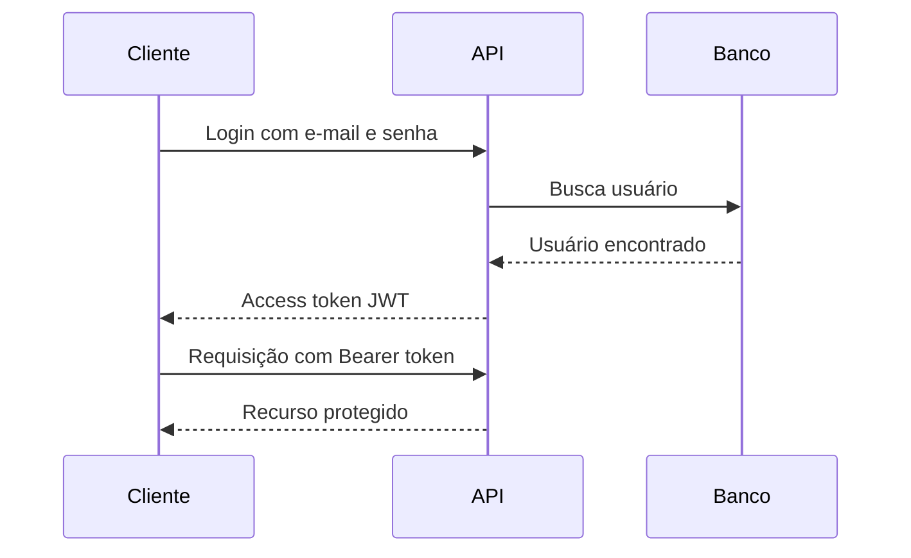

# Fluxo de autenticação

> Atualizar conforme a implementação do cadastro, login e validação do JWT.

```mermaid
sequenceDiagram
  participant C as Cliente
  participant A as API
  participant D as Banco

  C->>A: Login com e-mail e senha
  A->>D: Busca usuário
  D-->>A: Usuário encontrado
  A-->>C: Access token JWT
  C->>A: Requisição com Bearer token
  A-->>C: Recurso protegido
```
