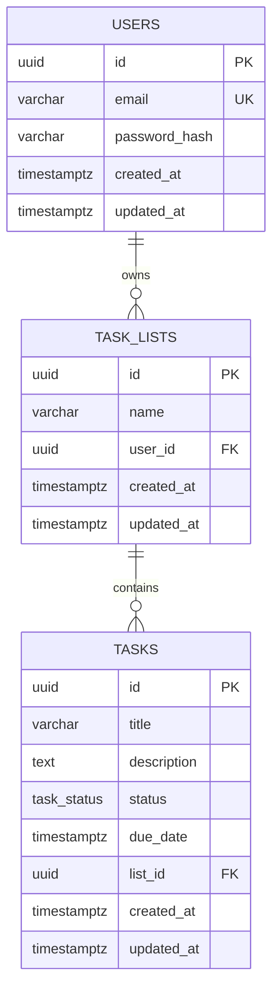

# Diagrama Entidade-Relacionamento

Modelagem definida em [`prisma/schema.prisma`](../../prisma/schema.prisma).

## Observações

- `task_status` é um enum PostgreSQL (`PENDING`, `IN_PROGRESS`, `COMPLETED`).
- `task_lists.user_id` possui `ON DELETE CASCADE`: remover um usuário remove suas listas.
- `tasks.list_id` possui `ON DELETE CASCADE`: remover uma lista remove suas tarefas.
- `(user_id, name)` é único em `task_lists` — um usuário não pode ter duas listas com o mesmo nome.
- Não existe `user_id` direto em `tasks`: a posse de uma tarefa é sempre resolvida através da lista à qual ela pertence (`tasks.list_id → task_lists.user_id`), e é isso que a camada de serviço valida em toda operação de escrita ou filtro.
